# Node-MCU-ESP8266-with-sensors

A grab-bag of Arduino sketches for getting common hobby sensors talking to a NodeMCU ESP8266 over USB serial.

> 2020 college-era IoT project. Each subfolder is a self-contained Arduino sketch covering one sensor / actuator. Treat it as a learning logbook for the ESP8266 GPIO map, not a finished product.

## What it does

Eight independent `.ino` sketches, each flashed individually, that drive a single peripheral on the NodeMCU dev board:

- Read temperature and humidity from a DHT11
- Read ambient light from an LDR digital module
- Read raw analog values from an IR sensor, soil-moisture probe, and a heartbeat / pulse sensor (all wired to `A0`)
- Read 3-axis acceleration from an ADXL345 over I2C
- Drive an RGB LED via PWM (`analogWrite`)
- Blink the onboard LED (`project_zero` smoke test)

Data destination is the **USB serial monitor at 115200 baud** in every sketch. There is no Wi-Fi client, no MQTT publisher, no cloud upload, no display. The ESP8266 here is essentially being used as "an Arduino with more pins" — the wireless radio is unused.

## Hardware

| Component                | Notes                                                          |
| ------------------------ | -------------------------------------------------------------- |
| NodeMCU ESP8266 (ESP-12E) | Xtensa LX106 @ 80 MHz, 4 MB flash, 1 ADC pin (`A0`, 0–3.3V)    |
| DHT11                    | 1-wire temperature + humidity                                  |
| LDR module (digital)     | Onboard comparator outputs HIGH/LOW                            |
| IR sensor                | Analog output                                                  |
| Soil moisture probe      | Analog output, threshold compared in firmware (`> 700` = dry)  |
| ADXL345                  | I2C 3-axis accelerometer, ±4G range configured                 |
| Heartbeat / pulse sensor | Analog output                                                  |
| RGB LED                  | Driven by 3 PWM pins                                           |
| USB cable, breadboard, jumper wires | Standard prototyping kit                            |

## Wiring

Pin assignments extracted directly from the sketches. The NodeMCU `Dx` labels and their underlying GPIO numbers:

| Sketch          | Sensor / actuator      | NodeMCU pin | GPIO    | Mode          |
| --------------- | ---------------------- | ----------- | ------- | ------------- |
| `DHT_sensor`    | DHT11 data             | `D5`        | GPIO14  | digital, 1-wire |
| `LDR_sensor`    | LDR digital out        | `D7`        | GPIO13  | digital input |
| `irsensor`      | IR analog out          | `A0`        | ADC0    | analog input  |
| `soilmoisture`  | Soil probe analog out  | `A0`        | ADC0    | analog input  |
| `soilmoisture`  | Status LEDs            | `D6`/`D7`/`D8` | 12/13/15 | digital output |
| `heartbeat`     | Pulse sensor analog    | `A0`        | ADC0    | analog input  |
| `accelerometer` | ADXL345 SCL            | `D1`        | GPIO5   | I2C clock     |
| `accelerometer` | ADXL345 SDA            | `D2`        | GPIO4   | I2C data      |
| `rgb_led`       | R / G / B              | `D5`/`D6`/`D8` | 14/12/15 | PWM (`analogWrite`) |
| `project_zero`  | Onboard LED            | GPIO16      | GPIO16  | digital output (active LOW) |

Sensors that share `A0` (IR, soil, heartbeat) are mutually exclusive — the ESP8266 only has one ADC channel, so only one analog sensor at a time.

## Architecture



## Setup

1. **Arduino IDE** 1.8.x (or 2.x).
2. Add the ESP8266 board manager URL in *Preferences → Additional Board Manager URLs*:
   ```
   http://arduino.esp8266.com/stable/package_esp8266com_index.json
   ```
   Then install **esp8266 by ESP8266 Community** from *Tools → Board → Boards Manager*.
3. Select board: **NodeMCU 1.0 (ESP-12E Module)**, upload speed `115200`.
4. Install libraries (Sketch → Include Library → Manage Libraries):
   - `DHT sensor library` by Adafruit (for `DHT_sensor`)
   - `Adafruit Unified Sensor` + `Adafruit ADXL345` (for `accelerometer`)
5. Open the desired `.ino` (e.g. `DHT_sensor/DHT_sensor.ino`), wire up the sensor as per the table above, and click **Upload**.
6. Open *Tools → Serial Monitor* at **115200 baud** to see output.

## What I'd do differently today

- **PlatformIO + ESP-IDF** instead of Arduino IDE: deterministic builds, real toolchain, FreeRTOS tasks, no `delay()` blocking loops.
- **Actually use the radio**: publish readings over MQTT to a local Mosquitto broker, or push to InfluxDB + Grafana. The whole point of an ESP8266 over an Arduino Nano is the Wi-Fi.
- **Non-blocking sampling**: replace `delay()` with `millis()` schedulers so multiple sensors can run in one sketch.
- **Calibrate the ADC**: the soil-moisture `> 700` threshold is hard-coded magic; should be a two-point calibration stored in EEPROM.
- **OTA updates**: ArduinoOTA so I'm not unplugging USB to re-flash every change.
- **One project, many sensors**: consolidate the eight sketches into a single firmware with a config flag, instead of duplicating `setup()` / `loop()` boilerplate.
- **Use a board with 2+ ADC channels** (ESP32) so the analog sensors aren't mutually exclusive.

## License

Not specified. Treat as personal/educational code.
